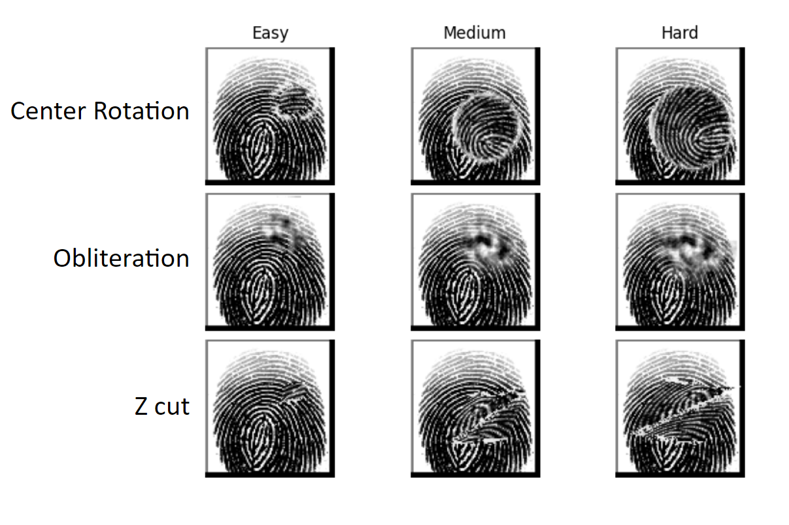

# Fingerprint Restoration

Code repository for "A Study on Performance Analysis of Deep Learning Algorithms in Fingerprint Reconstruction and Classification"

# Project Members

1. Chowdhury Md Abid Rahman
2. FNU Shivam
3. Jacob Thrasher

# Requirements

```
torch==2.1.0
torchvision==0.16.0
torchmetrics==1.2.1
tqdm==4.65.0
pandas==2.0.1
numpy==1.24.3
matplotlib==3.7.1
```

# Dataset

Sokoto Coventry Fingerprint Dataset (SOCOFing): https://www.kaggle.com/datasets/ruizgara/socofing/

SOCOFing consist of fingerprint samples 600 subjects, with 10 fingerprints per subject (1 for each finger). In addition, altered versions of these fingerprints are provided. The alterations consist of obliterations, center rotations, and z-cuts. There are 3 difficulties per alterations: Easy, Medium, and Hard. 



# Method

We used a VAE model to repair altered fingerprints. We conducted experiments on "Easy" and "Hard" alterations. In the following images, the top row corresponds to the ground truth (unaltered) images, middle row contains altered images, and the bottom row shows the repaired images generated by the VAE

")

")
